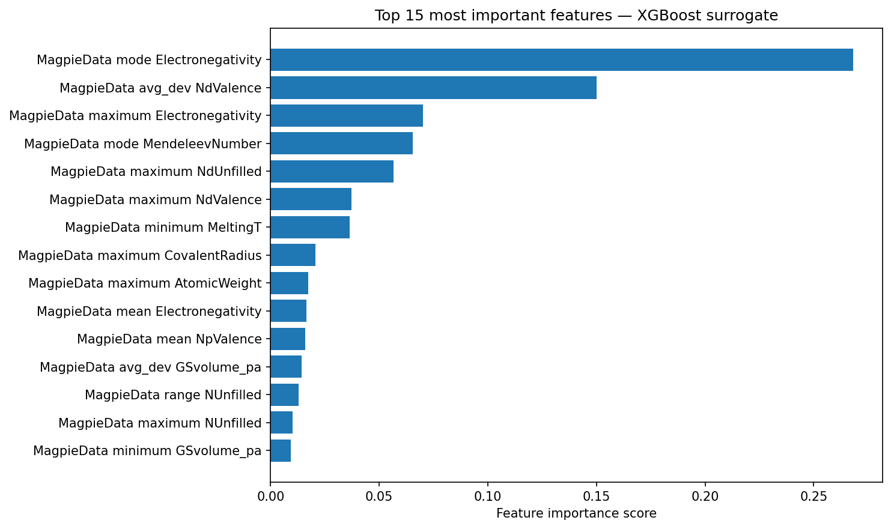
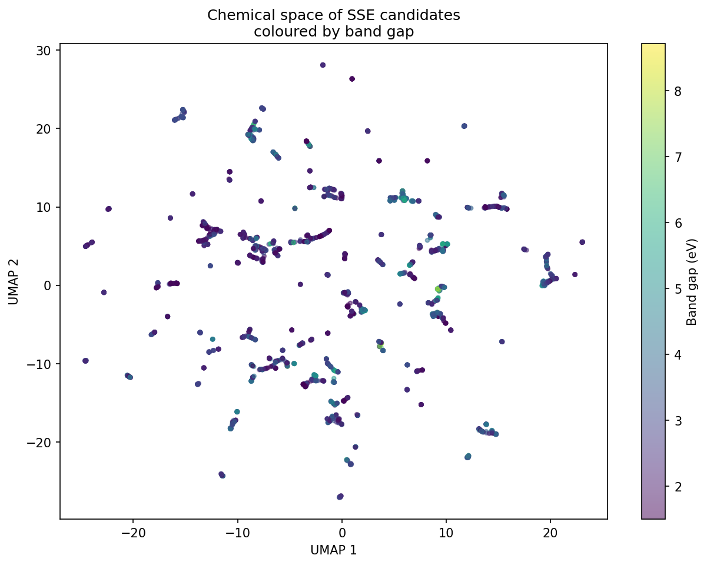

# Electrolyte Optimizer — Phase 1


> A materials informatics pipeline for solid-state battery electrolyte 
> discovery using machine learning.

---

## Project Overview

Solid-state electrolytes (SSEs) are the key bottleneck in next-generation 
battery development. Identifying promising SSE candidates from the vast 
chemical space of known materials is slow and expensive using traditional 
experimental methods.

This project builds a complete end-to-end materials informatics pipeline that:

- Extracts **21,764** Li-containing materials from the Materials Project API
- Filters to **4,017** validated SSE candidates using domain-driven criteria
- Featurizes crystal structures using **Magpie** compositional descriptors
- Trains an **XGBoost** surrogate model to predict band gap **(R²=0.83)**
- Visualizes the full chemical space using **UMAP** dimensionality reduction

This surrogate model serves as the reward signal for Phase 2 — conditional 
molecular generation using CDVAE.

---

## Key Results

| Metric | Value |
|--------|-------|
| Raw materials queried | 21,764 |
| SSE candidates after filtering | 4,017 |
| Retention rate | 18.4% |
| Surrogate model MAE | 0.328 eV |
| Surrogate model RMSE | 0.487 eV |
| Surrogate model R² | 0.828 |
| Most predictive features | NValence, Electronegativity |

---

## Pipeline Architecture
```
Materials Project API
        ↓
EXTRACT — query 5 chemical families
        ↓
TRANSFORM — 4 domain-driven filters
        ↓
FEATURIZE — 134 Magpie features
        ↓
SURROGATE MODEL — XGBoost
        ↓
UMAP — chemical space visualization
```

---

## ETL Pipeline Design

### Extract
Queries the Materials Project API across 5 chemical families with 
family-specific thresholds:

| Family | Examples | Hull cutoff | Gap cutoff |
|--------|----------|-------------|------------|
| Li oxides | LLZO, LIPON | 0.05 eV/atom | 2.0 eV |
| Li sulfides | Li6PS5Cl, LGPS | 0.10 eV/atom | 1.5 eV |
| Li phosphates | Li3PO4, NASICON | 0.06 eV/atom | 2.0 eV |
| Li halides | Li3InCl6 | 0.08 eV/atom | 1.8 eV |
| Li borates | Li2B4O7 | 0.06 eV/atom | 2.0 eV |

**Why separate queries per family:** Each family has different 
thermodynamic stability norms. A single unified query would apply 
incorrect thresholds across all families.

### Transform
Four filters derived from exploratory data analysis:

| Filter | Threshold | Justification |
|--------|-----------|---------------|
| Band gap | > 1.5 eV | Removes metals and semiconductors |
| Hull energy | < 0.1 eV/atom | Keeps thermodynamically stable materials |
| Unit cell size | 2 to 50 atoms | Removes single atoms and overly complex structures |
| Li fraction | > 0.10 | Ensures meaningful Li content for ionic conduction |

**Result:** 21,764 → 4,017 candidates (18.4% retention)

### Featurize
Each crystal structure converted to 134 numerical features:

- **132 Magpie features** — 5 statistics (min, max, range, mean, std) 
  across 22 elemental properties per formula
- **nsites** — unit cell complexity
- **Li_fraction** — Li atomic fraction derived from composition

### Surrogate Model
XGBoost regressor trained to predict band gap as a proxy for 
ionic conductivity suitability.

**Why band gap as target:** Materials Project has band gap calculated 
for almost all materials but ionic conductivity for almost none. 
Wide band gap is a necessary condition for SSE behavior — 
the material must block electrons while conducting Li ions.

---

## Results Visualizations

### Feature Importance


*NValence and electronegativity are the most predictive features. 
Both are physically meaningful — valence electrons and 
electronegativity directly determine electronic band structure.*

### Chemical Space — UMAP


*4,017 SSE candidates projected from 134 dimensions to 2D using UMAP. 
Colored by band gap (yellow = high, purple = low). High band gap 
materials are distributed across multiple chemical families.*

---

## Installation and Usage

### Requirements
```bash
pip install -r requirements.txt
```

### Run in Google Colab
1. Open `notebooks/phase1_pipeline.ipynb` in Google Colab
2. Mount your Google Drive
3. Add your Materials Project API key to Colab Secrets as `MP_API_KEY`
4. Run all cells in order

### Get a Materials Project API Key
Free with academic email at: https://materialsproject.org/api

---

## Project Structure
```
electrolyte_optimizer/
├── README.md                      
├── requirements.txt               
├── notebooks/
│   └── phase1_pipeline.ipynb      
└── results/
    ├── band_gap_distribution.png  
    ├── hull_energy_distribution.png
    ├── stability_vs_bandgap.png   
    ├── feature_importance.png     
    └── umap_chemical_space.png    
```

---

## Technical Stack

| Tool | Purpose |
|------|---------|
| PyMatGen | Crystal structure manipulation |
| mp-api | Materials Project API client |
| Matminer | Structure featurization (Magpie) |
| XGBoost | Surrogate model training |
| UMAP | Chemical space visualization |
| pandas / numpy | Data processing |
| matplotlib | Visualization |
| Google Colab | Development environment |

---

## Future Work — Phase 2

Phase 2 will implement conditional molecular generation using 
**CDVAE (Crystal Diffusion Variational Autoencoder)**:

- Convert 4,017 validated structures to crystal graph format
- Train CDVAE on the SSE dataset
- Generate novel electrolyte candidates conditioned on band gap target
- Screen generated candidates using the Phase 1 surrogate model
- Validate top candidates using CHGNet machine-learned force field

---

## Author

**Arathi Shaji**  
Masters Student — Materials Science  
GitHub: [@arathishaji303-cyber](https://github.com/arathishaji303-cyber)

---

## Acknowledgements

- Materials Project for the crystal structure database
- PyMatGen development team
- Matminer development team
- CDVAE authors (Xie et al., 2022)


