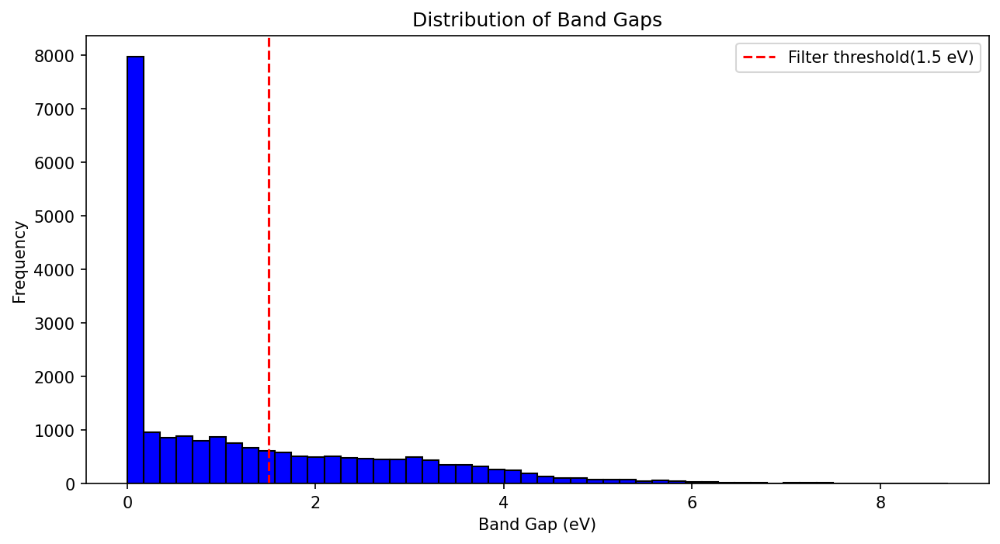
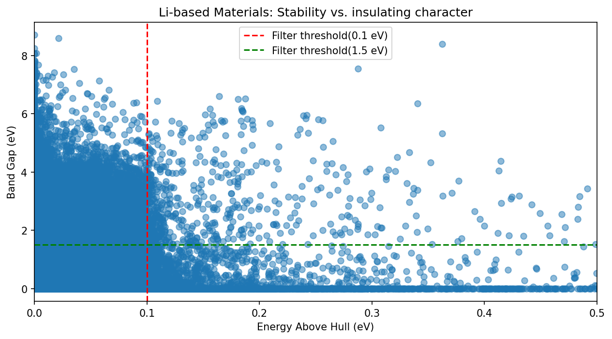

# Electrolyte Optimizer — Phase 1

> A materials informatics pipeline for solid-state battery 
> electrolyte discovery using machine learning.
> ## Project Overview

Solid-state electrolytes (SSEs) are the key bottleneck in next-generation 
battery development. Identifying promising SSE candidates from the vast 
chemical space of known materials is slow and expensive using traditional 
experimental methods.

This project builds a complete materials informatics pipeline that:

- Extracts 21,764 Li-containing materials from the Materials Project API
- Filters to 4,017 validated SSE candidates using domain-driven criteria
- Featurizes crystal structures using Magpie compositional descriptors
- Trains an XGBoost surrogate model to predict band gap (R²=0.83)
- Visualizes the chemical space using UMAP dimensionality reduction

## Key Results

| Metric | Value |
|--------|-------|
| Raw materials queried | 21,764 |
| SSE candidates after filtering | 4,017 |
| Retention rate | 18.4% |
| Surrogate model MAE | 0.328 eV |
| Surrogate model RMSE | 0.487 eV |
| Surrogate model R² | 0.828 |
| Most important features | NValence, Electronegativity |

---

## Results Visualizations

### Band Gap Distribution

*29.9% of raw Li-containing materials are metals (band gap = 0).
Filter band_gap > 1.5 eV removes these while preserving all 
genuine electrolyte candidates.*

### Stability vs Band Gap

*Top left quadrant — high band gap, low hull energy — contains 
your SSE candidates. Red line = hull filter (0.1 eV/atom), 
blue line = band gap filter (1.5 eV).*

### Feature Importance

*NValence and electronegativity dominate — both physically 
meaningful for band gap prediction.*

### Chemical Space — UMAP

*4,017 SSE candidates projected into 2D. Yellow = high band gap 
(good electrolyte candidates). High band gap materials distributed 
across multiple chemical families.*
